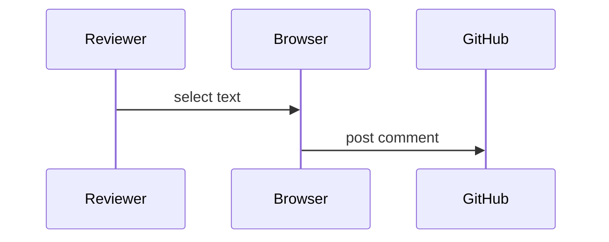

# RFD 42: Rendered review for Markdown documents

## Background

Reviewing prose in a raw diff is painful. Reviewers lose the *structure* of the
document and comment on **line numbers** rather than ideas.[^prior]

## Proposal

We render the document and keep a map from every rendered element back to its
source range. Selections become source claims:

1. Exact selected text.
2. A line and column range.
3. Surrounding context, including the `heading path`.

> Source positions refer to the raw blob, never to normalized text.

### Data flow

### Alternatives considered

| Option | Precision | Cost |
| :--- | :---: | ---: |
| Raw diff comments | line | none |
| Rendered review | character | parser |

## Open questions

- [x] Do we support footnotes?
- [ ] Do we support ~~PlantUML~~ server rendering?

See https://github.com/example/repo and <https://example.com/spec>.

[^prior]: See the earlier discussion in RFD 17.
